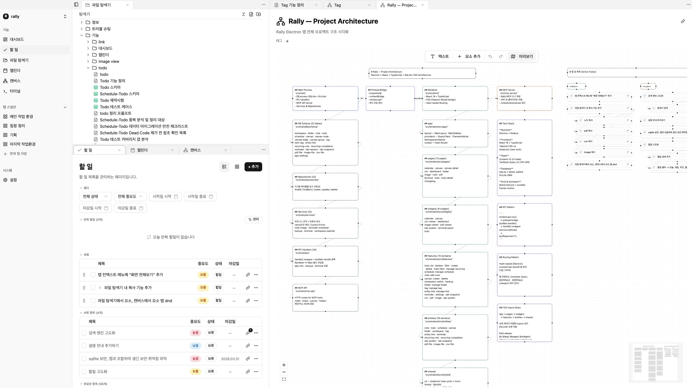

# Rally

**Rally**는 Electron + React + TypeScript로 제작된 로컬 우선(Local-First) 생산성 데스크탑 앱입니다.  
모든 데이터는 로컬 SQLite에 저장되며 인터넷 연결 없이 완전하게 동작합니다.

---

## 주요 기능

### 워크스페이스
- 여러 워크스페이스를 생성·전환하여 프로젝트별 데이터 분리 관리

### 노트 (Markdown)
- Milkdown 기반 WYSIWYG 마크다운 편집기
- 폴더 계층 구조 및 파일 시스템 동기화
- 내용 미리보기(최대 200자) 자동 생성

### 할 일 (Todo)
- 리스트 / 칸반 / 서브태스크(계층) 뷰
- 상태(할일·진행중·완료·보류), 우선순위(high·medium·low), 마감일·시작일
- 드래그 앤 드롭 순서 조정

### 반복 할일 (Recurring Todo)
- 매일·평일·주말·커스텀 요일 반복 규칙
- 시작/종료일, 알림 오프셋 설정

### 캘린더 / 스케줄
- 일정 생성 (종일·시간 지정), 색상·우선순위 태그
- 스케줄 연계 Todo 지원

### 캔버스
- React Flow 기반 자유 배치 화이트보드
- 노드·엣지·그룹 지원, 뷰포트 상태 저장

### 파일 뷰어
- PDF 뷰어 (react-pdf)
- 이미지 뷰어 (zoom·pan)
- CSV 뷰어 (TanStack Table + 가상 스크롤)

### 터미널
- xterm.js + node-pty 기반 내장 터미널

### 태그 & 엔티티 링크
- 노트·Todo·파일 등 항목 간 태그 및 양방향 링크

### 리마인더
- Todo·스케줄 알림 (오프셋 기반 예약 발송)

### MCP 서버 (내장)
- 앱 내 HTTP MCP 서버를 통해 Claude 등 AI 에이전트와 연동
- 워크스페이스·노트·캔버스·할 일 등 주요 리소스를 MCP 도구로 노출

---

## 사용 화면



---

## 기술 스택

| 영역 | 기술 |
|------|------|
| 런타임 | Electron 39 |
| UI | React 19, TypeScript 5 |
| 빌드 | electron-vite 5, Vite 7 |
| 스타일 | Tailwind CSS v4, shadcn/ui (New York) |
| 상태 관리 | Zustand v5 (UI), TanStack React Query v5 (IPC/비동기) |
| 라우팅 | React Router v7 (Hash-based) |
| DB | SQLite (better-sqlite3), Drizzle ORM |
| 폼/검증 | react-hook-form + Zod |
| 에디터 | Milkdown (마크다운) |
| 캔버스 | @xyflow/react (React Flow) |
| 터미널 | xterm.js + node-pty |
| DnD | @dnd-kit/core + @dnd-kit/sortable |
| 애니메이션 | framer-motion |
| 테스트 | Vitest + Testing Library + happy-dom |

---

## 아키텍처

### Electron 3-프로세스 구조

```
src/main/      → 메인 프로세스 (Node.js, DB 접근, IPC 핸들러, MCP 서버)
src/preload/   → 보안 브릿지 (contextBridge로 renderer에 제한된 API 노출)
src/renderer/  → React 앱 (브라우저 환경, Node 직접 접근 불가)
```

렌더러는 **오직 `window.api.*`(preload 브릿지)** 를 통해서만 메인 프로세스와 통신합니다.

### Feature-Sliced Design (FSD)

```
src/renderer/src/
├── app/       → 루트 프로바이더, 라우터, 레이아웃, 전역 스타일
├── pages/     → 라우트 페이지 컴포넌트
├── widgets/   → 복합 UI 모듈
├── features/  → 사용자 인터랙션 로직 (폼, 액션)
├── entities/  → 도메인 모델 및 UI
└── shared/    → 재사용 유틸리티, 훅, UI 컴포넌트
```

레이어 간 임포트는 **아래 방향만** 허용됩니다 (`app → pages → widgets → features → entities → shared`).

### DB 레이어 (메인 프로세스)

```
schema/        → Drizzle 테이블 정의
repositories/  → 순수 CRUD (findAll / findById / create / update / delete)
services/      → 비즈니스 로직 (검증, ID 생성, 날짜 처리, Custom Error)
ipc/           → IPC 핸들러 등록 + handle() 래퍼
```

---

## 시작하기

### 요구사항

- Node.js 20+
- npm 10+

### 설치

```bash
npm install
```

### 개발 서버

```bash
npm run dev
```

### 빌드

```bash
# macOS
npm run build:mac

# Windows
npm run build:win

# Linux
npm run build:linux
```

---

## 개발 명령어

```bash
# 타입 검사
npm run typecheck

# 린트
npm run lint

# 포맷
npm run format

# 테스트 (메인 프로세스)
npm run test

# 테스트 (렌더러)
npm run test:web

# DB 마이그레이션 생성
npm run db:generate

# DB 마이그레이션 적용
npm run db:migrate

# DB GUI (Drizzle Studio)
npm run db:studio

# MCP 서버 빌드
npm run build:mcp
```

---

## 경로 별칭

```ts
@/       → src/renderer/src/
@app/    → src/renderer/src/app/
@pages/  → src/renderer/src/pages/
@widgets/→ src/renderer/src/widgets/
@features/ → src/renderer/src/features/
@entities/ → src/renderer/src/entities/
@shared/ → src/renderer/src/shared/
```

---

## 코드 스타일

Prettier 설정 (`.prettierrc.yaml`):

- 싱글 쿼트
- 세미콜론 없음
- 출력 너비: 100
- 후행 쉼표 없음
