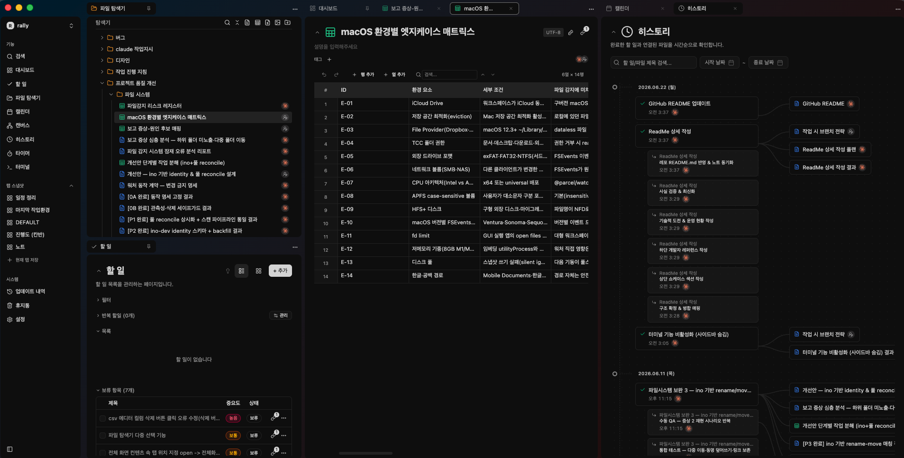

# Rally

**AI 에이전트와 함께 쓰는 개발자용 생산성 데스크탑 앱**

할일·노트·캔버스·캘린더를 하나로 통합하고, MCP를 통해 Claude·Codex 같은 AI 에이전트가 앱을 직접 읽고 제어합니다.
모든 데이터는 로컬 SQLite에 저장되어 인터넷 없이 완전하게 동작합니다 (Local-First).


---

## 왜 Rally인가

AI와 대화한 결과물은 채팅창에 묻혀버립니다. Rally는 그 결과물을 **눈에 보이는 형태로 추적**하기 위해 만들었습니다.

- Claude Desktop / Claude Code / Codex (CLI · Desktop) 가 Rally의 할일·노트를 직접 읽고 씁니다
- 할일에 스펙 문서를 연결하면 AI가 컨텍스트를 파악하고 자율 코딩합니다
- 완료된 작업은 연결 문서와 함께 히스토리로 남습니다

사람이 방향을 잡고, AI가 디테일을 채우고, 사람이 최종 판단합니다.

---

## 핵심 워크플로우

```
1. 할일 작성 + 스펙 노트 연결
2. Claude Code에게 "스펙 읽고 보완해줘" 요청
3. 생성된 노트 검토 · 다듬기
4. "개발 착수해줘" → 자율 코딩 실행
5. 완료 처리 → 히스토리에 할일 + 연결 문서 기록
```

---

## 주요 기능

### 생산성 코어

- **탭 기반 레이아웃** — VSCode처럼 여러 파일을 동시에 열고 전환
- **파일 탐색기** — 워크스페이스 단위 폴더 계층 · DnD로 열기/이동 · 파일 시스템 동기화
- **노트** — Milkdown 기반 WYSIWYG 마크다운 · Floating Toolbar · 스타일 커스텀 · 템플릿
- **할일** — 리스트 / 칸반 / 서브태스크(2depth) · 상태·우선순위·시작일/마감일 · DnD 정렬
- **반복 할일** — 매일·평일·주말·커스텀 요일 규칙 · 알림 오프셋
- **캔버스** — React Flow 기반 자유 배치 보드 · 노드/엣지/그룹 · 캔버스 중첩 · 뷰포트 저장
- **캘린더 / 스케줄** — 일정(종일·시간 지정) · 색상·우선순위 · 스케줄 연계 Todo
- **파일 뷰어** — PDF(react-pdf) · 이미지(zoom·pan) · CSV(TanStack Table + 가상 스크롤)
- **태그 & 링크** — 노트·할일·파일 간 태그 및 양방향 엔티티 링크
- **히스토리** — 완료 할일 + 연결 파일을 날짜별로 추적
- **리마인더** — 할일·스케줄 알림 (오프셋 기반 예약 발송)
- **터미널 (내장)** — xterm.js + node-pty 기반 터미널 · tmux 세션 영속성
- **휴지통** — soft delete · 자동 비우기 · 연결 복구

### AI 통합 (MCP)

- 앱 내 HTTP MCP 서버로 Claude Desktop · Claude Code · Codex (CLI · Desktop) 연동
- 할일에 스펙 문서를 연결하면 AI가 컨텍스트를 파악한 뒤 자율 코딩
- MCP로 생성·수정된 노트·할일이 히스토리에 추적됨
- **MCP v2 — 총 17개 도구** (`read_*` / `manage_*` prefix 통일 + 의도 단위 도메인 통합)
  - **Discovery (3)**: `search`, `browse`, `read_workspace`
  - **Read content (5)**: `read`, `read_tasks`, `read_trash`, `read_templates`, `read_note_image`
  - **Manage content (3)**: `manage_content`, `manage_canvas`, `manage_templates`
  - **Manage work (1)**: `manage_tasks` (todo/schedule/recurring/reminder 통합)
  - **Manage organize (4)**: `manage_items` (folders+files 통합), `manage_links`, `manage_tags`, `manage_trash`
  - **Manage workspace (1)**: `manage_workspace`

---

## 사용 예시

### 1. AI 연동 등록

설정에서 **Claude Desktop / Claude Code / Codex 연동**을 켜면, Rally가 각 클라이언트 설정 파일에
MCP 서버(`rally`)를 자동 등록합니다. (Codex는 CLI·Desktop이 동일한 `~/.codex/config.toml`을 공유)

```jsonc
// Claude Desktop: claude_desktop_config.json
// Claude Code:    ~/.claude.json
{
  "mcpServers": {
    "rally": {
      /* Rally 앱이 실행 중일 때 로컬 HTTP MCP 서버로 연결 */
    }
  }
}
```

```toml
# Codex (CLI · Desktop): ~/.codex/config.toml
[mcp_servers.rally]
# Rally 앱이 실행 중일 때 로컬 HTTP MCP 서버로 연결
```

등록 후 클라이언트를 재시작하면 17개 MCP 도구가 노출됩니다.

### 2. AI에게 작업 맡기기

할일에 스펙 노트를 연결해두고 Claude Code에게 자연어로 지시합니다.

```
나: "로그인 기능 할일에 연결된 스펙 노트 읽고, 빠진 엣지 케이스 보완해줘"
Claude: (read_tasks → browse → read 로 컨텍스트 파악)
        → manage_content 로 스펙 노트 업데이트
        → manage_tasks 로 subtodo 추가

나: "그대로 개발 착수해줘"
Claude: 코드 작성 → 완료된 subtodo 체크 → 결과 노트 작성 + 할일에 링크
```

### 3. 워크스페이스 직접 조작

```
"오늘 마감인 할일 보여줘"           → read_tasks(mode: today)
"이번 주 회의록 노트로 정리해줘"     → manage_content(create) + manage_links
"#버그 태그 달린 항목 전부 찾아줘"   → browse(tagId) / search
```

사람은 방향과 검토에 집중하고, 반복적인 읽기·쓰기·정리는 AI가 도구로 처리합니다.

---

## 사용 화면



---

## 기술 스택

| 영역       | 기술                                                  |
| ---------- | ----------------------------------------------------- |
| 런타임     | Electron 39                                           |
| UI         | React 19, TypeScript 5                                |
| 빌드       | electron-vite 5, Vite 7                               |
| 스타일     | Tailwind CSS v4, shadcn/ui (New York)                 |
| 상태 관리  | Zustand v5 (UI), TanStack React Query v5 (IPC/비동기) |
| 라우팅     | React Router v7 (Hash-based)                          |
| DB         | SQLite (better-sqlite3), Drizzle ORM                  |
| 폼/검증    | react-hook-form + Zod                                 |
| 에디터     | Milkdown (마크다운)                                   |
| 캔버스     | @xyflow/react (React Flow)                            |
| 터미널     | xterm.js + node-pty                                   |
| DnD        | @dnd-kit/core + @dnd-kit/sortable                     |
| 애니메이션 | framer-motion                                         |
| AI 연동    | MCP (Model Context Protocol)                          |
| 테스트     | Vitest + Testing Library + happy-dom                  |
| 빌드/배포  | electron-builder + GitHub Actions (자동 업데이트)     |

---

## 아키텍처

### Electron 3-프로세스 구조

```
src/main/      → 메인 프로세스 (Node.js, DB 접근, IPC 핸들러, MCP 서버)
src/preload/   → 보안 브릿지 (contextBridge로 renderer에 제한된 API 노출)
src/renderer/  → React 앱 (브라우저 환경, Node 직접 접근 불가)
```

렌더러는 **오직 `window.api.*`(preload 브릿지)** 를 통해서만 메인 프로세스와 통신합니다.

### Feature-Sliced Design (FSD)

```
src/renderer/src/
├── app/       → 루트 프로바이더, 라우터, 레이아웃, 전역 스타일
├── pages/     → 라우트 페이지 컴포넌트
├── widgets/   → 복합 UI 모듈
├── features/  → 사용자 인터랙션 로직 (폼, 액션)
├── entities/  → 도메인 모델 및 UI
└── shared/    → 재사용 유틸리티, 훅, UI 컴포넌트
```

레이어 간 임포트는 **아래 방향만** 허용됩니다 (`app → pages → widgets → features → entities → shared`).

### DB 레이어 (메인 프로세스)

```
schema/        → Drizzle 테이블 정의
repositories/  → 순수 CRUD (findAll / findById / create / update / delete)
services/      → 비즈니스 로직 (검증, ID 생성, 날짜 처리, Custom Error)
ipc/           → IPC 핸들러 등록 + handle() 래퍼
```

---

## 기술적 도전

### O(n²) → O(n) 폴더 트리 최적화

`buildChildren`이 재귀 호출마다 전체 `fsEntries`를 `.filter()` 하는 구조였습니다.
부모→자식 Map을 시작 시 한 번 구축하는 방식으로 변경해 `folder:readTree` 응답을 **7,300ms → 24ms**로 단축했습니다.

### 대규모 코드베이스 리팩토링

P0~P3 우선순위 매트릭스로 진단 후 테스트 안전망을 먼저 구축하고, 15개 PR로 분할 실행했습니다.

- `trash.ts` 1,079줄 → 전략 패턴으로 책임 분리
- `backup.ts` 파이프라인 분해 (`any` 33회 제거)
- `FolderTree.tsx` 951줄 → 훅 분해 + `React.memo`
- Electron `sandbox: true` 전환 + IPC zod 검증
- MCP API 256bit 토큰 인증 + Unix 소켓 0600 권한

### MCP v1 → v2 백지 재설계

29개 도구를 "타입 다형성 > 도메인 분리" 원칙으로 17개로 통합했습니다.
`read_*` / `manage_*` 두 prefix로 일관성을 확보하고 배치 처리와 페이지네이션을 표준화했습니다.

---

## 품질 게이트

품질 기준은 수치와 CI 자동 게이트로 명문화되어 있습니다 — lint(`--max-warnings 0`), typecheck,
coverage threshold, **bundle budget**(메인 청크 gzip ≤ 430KB), Electron security(HIGH=0),
FSD boundary, IPC contract drift 등.
평가 축·개선 전후 지표·남은 tradeoff는 [`QUALITY.md`](./QUALITY.md)를 참고하세요.

---

## 시작하기

### 요구사항

- Node.js 20+
- npm 10+

### 설치

```bash
npm install
```

### 개발 서버

```bash
npm run dev
```

### 빌드

```bash
npm run build:mac    # macOS
```

---

## 개발 명령어

```bash
# 타입 검사
npm run typecheck

# 린트 / 포맷
npm run lint
npm run format

# 테스트 (메인 프로세스 / 렌더러)
npm run test
npm run test:web

# DB 마이그레이션 생성 / 적용 / GUI
npm run db:generate
npm run db:migrate
npm run db:studio

# MCP 서버 빌드
npm run build:mcp
```

---

## 경로 별칭

```ts
@/         → src/renderer/src/
@app/      → src/renderer/src/app/
@pages/    → src/renderer/src/pages/
@widgets/  → src/renderer/src/widgets/
@features/ → src/renderer/src/features/
@entities/ → src/renderer/src/entities/
@shared/   → src/renderer/src/shared/
```

---

## 코드 스타일

Prettier 설정 (`.prettierrc.yaml`):

- 싱글 쿼트
- 세미콜론 없음
- 출력 너비: 100
- 후행 쉼표 없음

---

## 운영 현황

- **v1.0.0** (2026-03) 첫 릴리즈 → **v1.16.1** 현재
- 약 4개월간 **58회 릴리즈**, 실사용자 피드백 기반 지속 업데이트
- GitHub Releases 자동 업데이트 지원

---

## 라이선스

MIT
